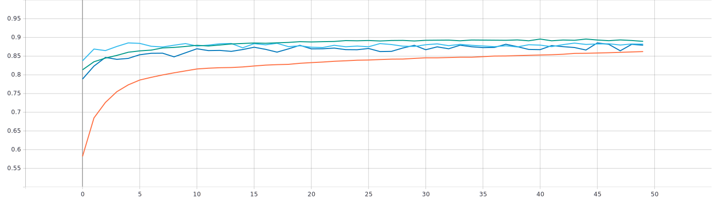
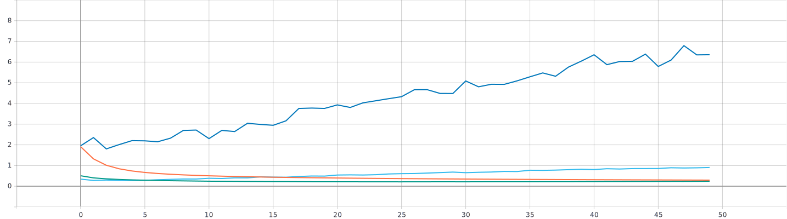
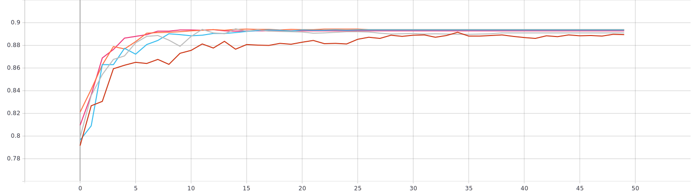
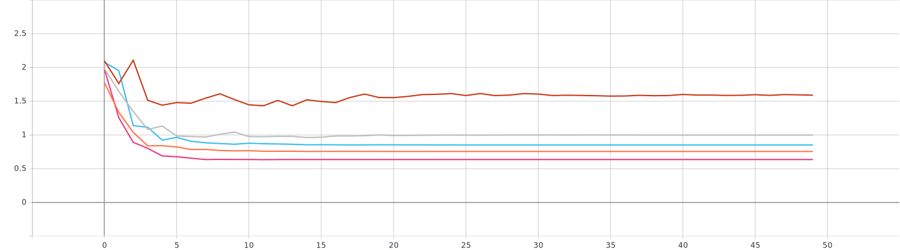
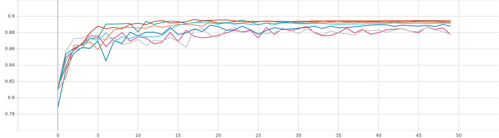
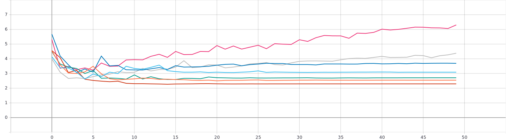

# Изучение влияние параметра “темп обучения” на процесс обучения нейронной сети на примере решения задачи классификации Oregon Wildlife с использованием техники обучения Transfer Learning
## ```# static_lr.py```
## 1. Графики тренировки нейронной сети со статическим темпом обучения 

### epoch categorical accuracy


### epoch loss

***
## Анализ
Лучше всех себя показал ```lr = 0.001```. Точность его составила ```~0.8871``` за ```~20``` эпох. Хуже всех показал себя ```lr = 0.0001```. За ```50``` эпох он смог достичь точности лишь ```0.8622```, что на ```0.0249``` меньше чем ```lr = 0.001```. </br> Итог: параметр, обеспечивающий самую быструю скорость сходимости - ```0.01```, параметр, обеспечивающий максимальную точность: ```0.001```. Оптимальным будем считать ```lr = 0.001```
## ```# n_static_lr.py```

### Формула
```python
lrate = initial_lrate * exp(-k * num_epoch)
```
## 2. Графики тренировки нейронной сети с темпом обучения, изменяющегося по экспоненциальному закону с параметрами: </br>
```initial_lrate = 0.1``` </br> 
```k = 0.1, 0,2, ..., 0.5``` </br> 
```num_epoch = 1, 2, ..., 50``` </br> </br>


### epoch categorical accuracy

### epoch loss

***
## Анализ
Используя темп обучения изменяющийся по экспоненциальному закону удалось добиться большей скорости сходимости (```~15``` эпох) для всех ```k != 0.1```, в сравнении с ```lr = 0.001```. Среди всех представленных вариантов экспоненциального затухания выделяется лишь ```k = 0.1```. Скорость его сходимости составила ```~30``` эпох, что на ```15``` эпох больше, в сравнении с другими вариантами. Точность в среднем меньше на ```0.04```. </br> Итог: параметр, обеспечивающий самую быструю скорость сходимости - ```k = 0.5```, параметр, обеспечивающий максимальную точность - все, кроме ```k = 0.1```. Оптимальный будем считать ```k = 0.5```
### Формула
```python
lrate = initial_lrate * drop^floor(epoch / epochs_drop) 
```
## 3. Графики тренировки нейронной сети с темпом обучения, изменяющегося по ступенчатому закону с параметрами: </br>
```initial_lrate = 0.1``` </br> 
```drop = 0.99, 0.95, 0.5, 0.4, 0.35, 0.3, 0.1``` </br> 
```epochs_drop = 1, 2, 10, 7, 7, 5, 1``` </br> </br> 


### epoch categorical accuracy

### epoch loss

***
# Анализ
3 Варианта,а именно ```drop = 0.4, 0.35, 0.3```, ```epochs_drop = 7, 7, 5``` показали примерно одинаковые результаты(```~15``` эпох для сходимости, ```~0.893``` точность), оставшиеся 3 проявили себя немного хуже(```~18``` эпох для сходимости, ```~0.88``` точность). Из этого можно сделать вывод что уменьшение ```epochs_drop``` и увеличение ```drop``` позитивно сказывается на скорости сходимости и точности модели. Итог: вариант со следующими параметрами показал как самую быструю скорость сходимости, так и максимальную точность - ```drop = 0.3```, ```epochs_drop = 5```.
# Итог итогов
Благодаря применению политик экспотенциального и пошагового(ступенчатого) изменения темпа обучения удалось добиться большей скорости сходимости(примерно на ```12``` эпох), хотя прибавка в точности совсем незначительная(```~0.002```)
