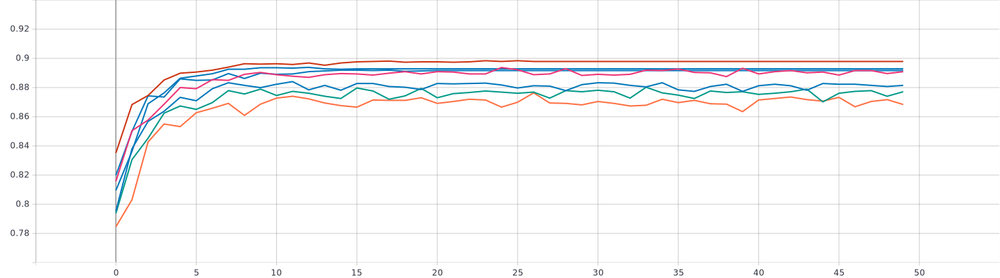
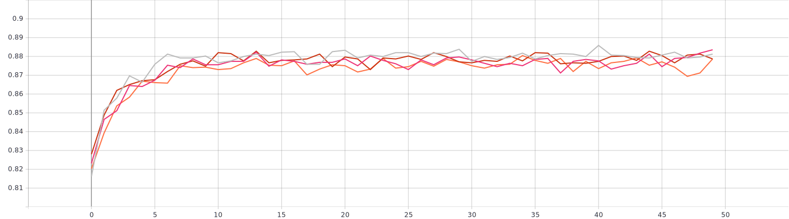
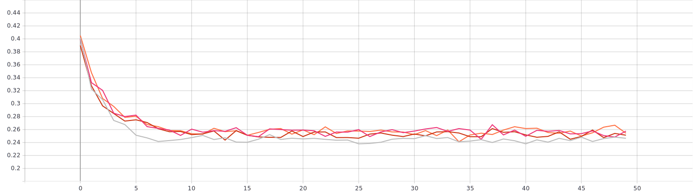

# Использование техник аугментации данных для улучшения сходимости процесса обучения нейронной сети на примере решения задачи классификации Oregon Wildlife
Ниже представлены результаты тренировки EfficientNet-B0 (предварительно обученной на базе изображений imagenet) с использованием 4-ех видов аугментации, а таксе их композиция. Все графики представлены для валидационного набора данных.
## 1. Манипуляции с яркостью и контрастом
### ```# brightness_contrast.py```

Изначально формула для темпа обучения использовалась следующая:
```python
   1. lrate = 0.01 * exp(-0.3 * num_epoch)
```
После 3 тренировок она была заменена на: </br>
```python
   2. lrate = 0.01 * exp(-0.3 * num_epoch)
```
На легенде ниже у графиков полученных с помощью первого способа задания темпа обучения в имени отсутствует параметр ```k```. Остальные графики были получены с импользванием второго способа. </br>
Сравнивая эти два способа изменения темпа обучения видно что второй показал себя лучше и поэтому будет использваться далее везде, где не будет уточнено обратное. </br></br>





Изменяя яркость и контраст удалось найти параметры увеличивающие точность на ```~0.05```, в сравнении с экспоненциальным изменением темпа обучения с параметрами  ```initial_lrate = 0.1, k = 0.5```. Эти параметры будет считать оптимальными.
## 2. Поворот изображения на случайный угол
### ```# rotate.py```
### 2.1 Исследование параметров 


Максимальной точности (```~0.89```), что на ```~0.02``` хуже чем без аугментации, удалось достить благодаря параметрам ```alpha = 15, p = 0.25```, их и будем считать оптимальными.
### 2.2 Исследование методов интерполяции и экстраполяции 




На графике с именем ```Rotate_a15_p1_k0.3``` использовались следующие методы интерполяции: ```interpolation - LINEAR```,  ```extrapolation - REFLECT_101``` соответсвенно. По результатам тренировки лучшего метода апроксимации и интерполяции определить не удалось, так как показали они себя в среднем одинаково (```~0.8``` точность). Поэтому оптимальными будем считать параметры: ```interpolation - LINEAR```,  ```extrapolation - REFLECT_101```.
## 3. Использование случайной части изображения
### ```# crop.py```


В результате применения метода спользование случайной части изображения удалось тостичь максимальной точности (```~0.89```), что в среднем на (```0.02```) меньше чем без угментации. Параметры при которых нам удалось достичь такого результата будем считать оптимальными.
## 4. Добавление случайного шума
### ```# noise.py```


Добавляя случайный шум удалось получить точность как при использовании экспоненциального закона изменения темпа обучения с параметрами ```initial_lrate = 0.1, k = 0.5```, а именно ```~0.8925```. Поэтому оптимальными парамтерами будем считать ```min = 50, max = 60, p = 1```
## 5. Композиция
```python
print('fd')
```


