# Решение задачи классификации изображений из набора данных Oregon Wildlife с использованием нейронных сетей глубокого обучения и техники обучения Fine Tuning
## 1. Тренировка без применения Fine Tuning

accuracy
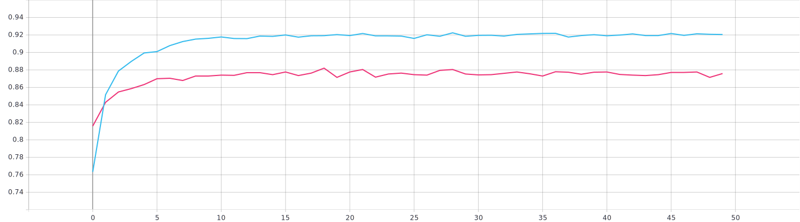
loss
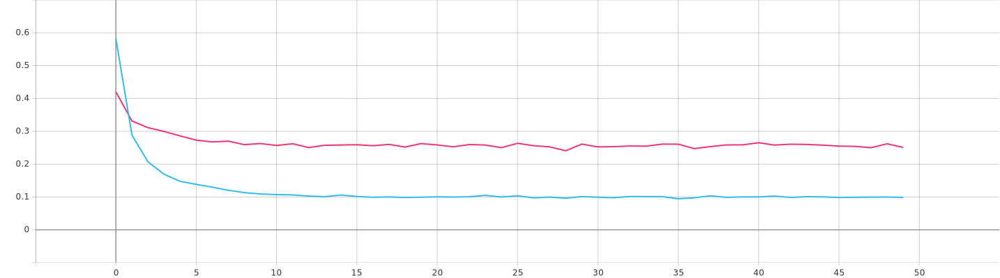

## 2. Нахождение оптимального темпа обучения 
### 1 Статический 

accuracy
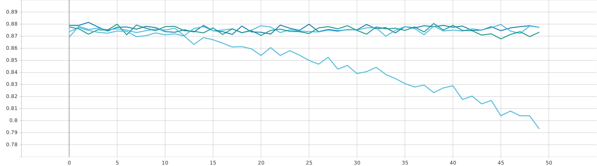
loss
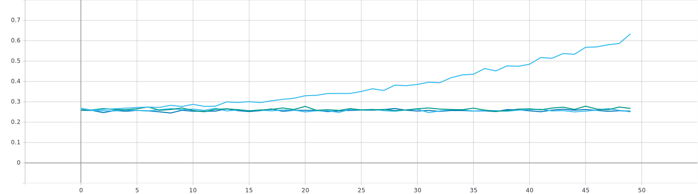

accuracy
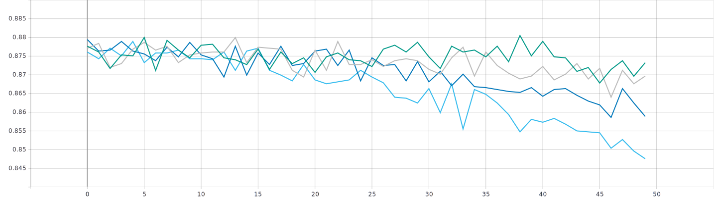
loss
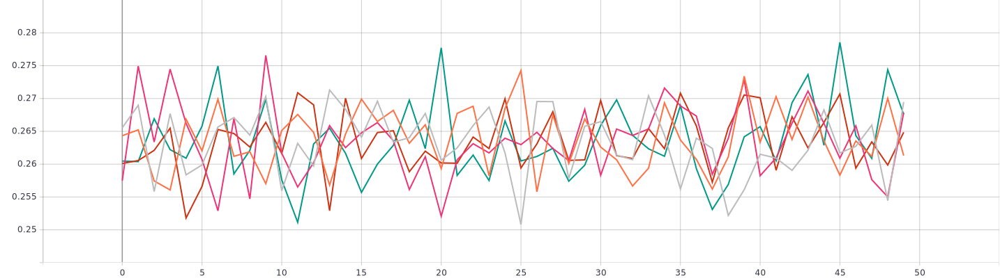

### 2. Изменяющийся по экспоненциальному закону

accuracy
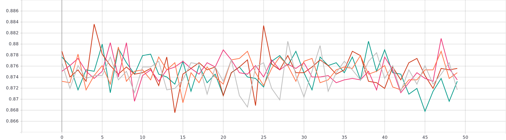
loss
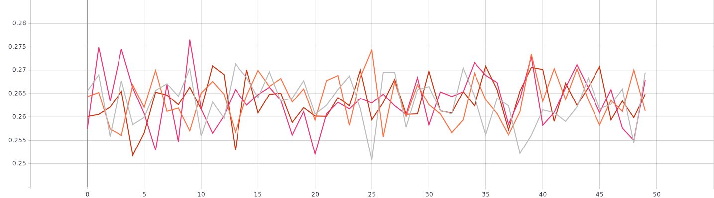

### 3. Изменяющийся по ступенчатому закону 

accuracy
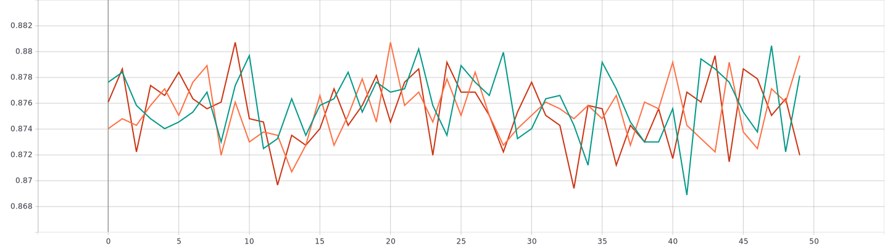
loss
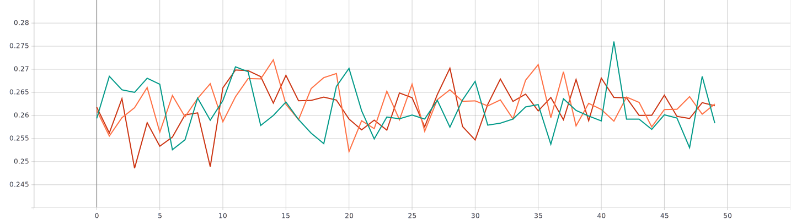

### Сравнение 3-х вышеописанных способов инициализации темпа обучения 

accuracy
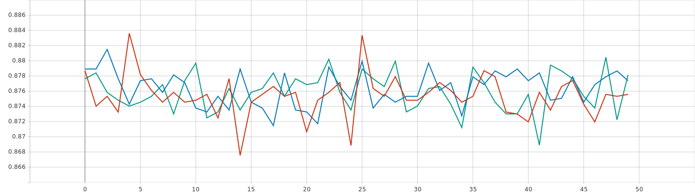
loss
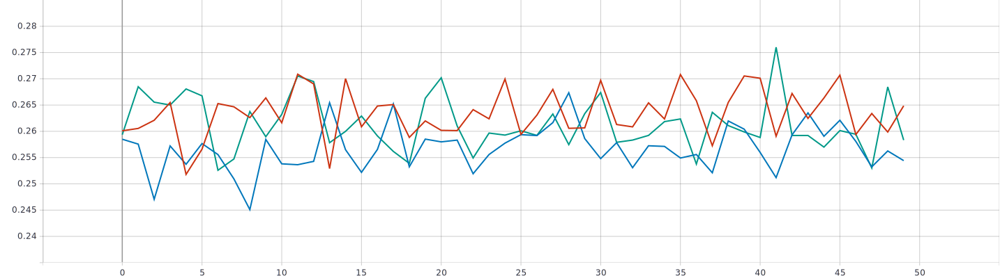

## 3. Тренировка с применением Fine Tuning

accuracy
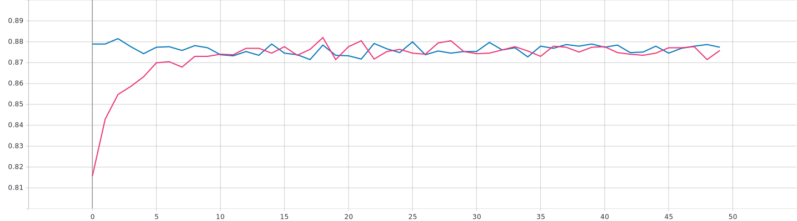
loss
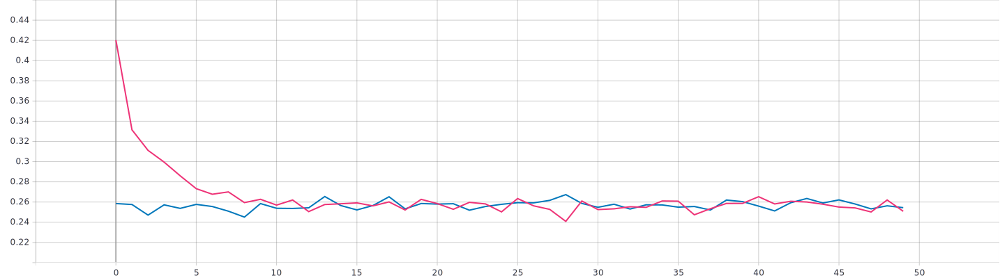
