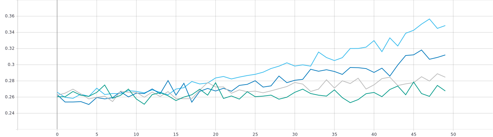
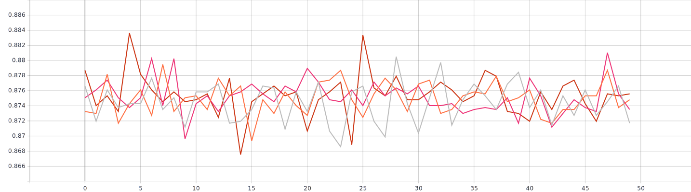

# Решение задачи классификации изображений из набора данных Oregon Wildlife с использованием нейронных сетей глубокого обучения и техники обучения Fine Tuning
## 1. Тренировка без применения Fine Tuning
 </br>
accuracy

loss


## 2. Нахождение оптимального темпа обучения 
### 2.1 Статический 
 </br>
accuracy

loss

Из 4-х вариантов у ```lr = 1e-9``` точность в среднем  на ```~0.007``` больше чем у ```lr = 1e-8``` и у ```lr = 1e-10```. Его у будем считать оптимальным из предложенных вариантов </br>


 </br>
accuracy

loss


### 2.2 Изменяющийся по экспоненциальному закону
Формула изменения темпа обучния имеет следующий вид:
```python
lrate = 1e-8 * exp(-k * num_epoch)
``` 
Где ```k = 0.3, 0.5, 0.7, 0.9``` </br></br>
 </br>
accuracy

loss


### 2.3 Изменяющийся по ступенчатому закону 
```python
lrate = initial_lrate * drop^floor(epoch / epochs_drop) 
```
 </br>
accuracy

loss


### 2.4 Сравнение 3-х вышеописанных способов инициализации темпа обучения 
 </br>
accuracy

loss


## 3. Тренировка с применением Fine Tuning


